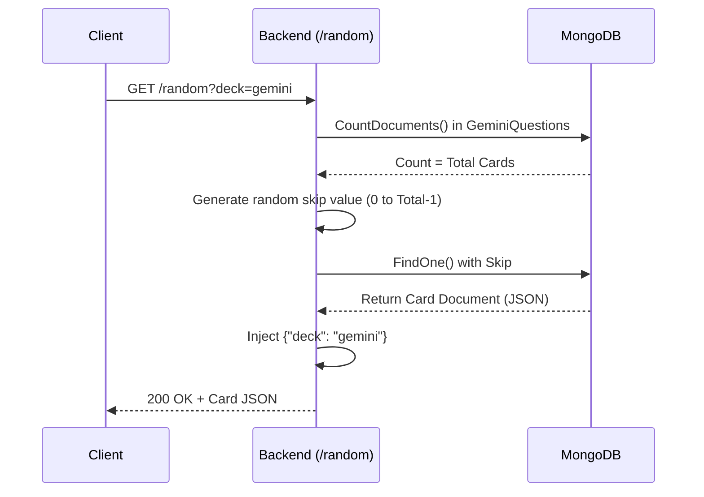
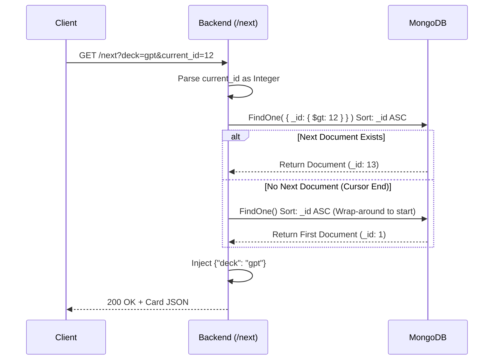

# ProjectSHASN Backend - Architectural Overview

## 1. Introduction
The **ProjectSHASN Backend** is a high-performance REST API built in Go (1.25.0) that acts as the backend service for the SHASN project. Its primary role is to serve ideological cards (which contain questions, statements representing different personas, and a caution level) from a MongoDB database. Currently, it supports two collections of questions: **Gemini** and **GPT**.

## 2. Architecture Diagram

Below is the high-level architecture of how incoming requests are processed and how the application interacts with the data layer.

```mermaid
graph TD
    Client[Client App/Frontend] -->|HTTP GET Request| GinRouter[Gin HTTP Router (Port 8080)]
    
    subgraph Go Backend Service
        GinRouter -->|Route: /random| RandomHandler[getRandomCard]
        GinRouter -->|Route: /next| NextHandler[getNextCard]
        
        RandomHandler --> MongoDriver[go.mongodb.org/mongo-driver]
        NextHandler --> MongoDriver
    end
    
    subgraph Database Layer
        MongoDriver -->|Reads| DB[(MongoDB: Project_SHASN)]
        DB --> GeminiColl[Collection: GeminiQuestions]
        DB --> GPTColl[Collection: GptQuestions]
    end
```

## 3. Data Flow and API Endpoints

The application utilizes the **Gin Web Framework** to expose two main endpoints to the frontend, complete with CORS headers to support cross-origin development (allowing `GET` and `OPTIONS`).

### 3.1 Random Card API
- **Endpoint:** `/random?deck={gemini|gpt}`
- **Flow:** This endpoint first counts the documents in the specified deck, generates a deterministic random skip value, and then performs a `FindOne` query with that skip to fetch a random card.



### 3.2 Fetch Next Card API
- **Endpoint:** `/next?deck={gemini|gpt}&current_id={id}`
- **Flow:** This endpoint retrieves the *next seqential* card. It queries MongoDB for the first document where `_id > current_id` (sorted ascending). It features a convenient **wrap-around fallback**: if no subsequent documents are found, it queries for the very first document in the collection.



## 4. Key Logical Components

1. **`main.go`**: The entry point. Handles MongoDB connection pooling (`mongo.Connect`), configuring standard request routing via Gin, CORS configuration middleware, and houses the route handler functions (`getRandomCard`, `getNextCard`).
2. **MongoDB Data Scheme**: Cards are structured dynamically as `map[string]interface{}` locally to keep retrieval flexible. While MongoDB acts as a schemaless store, typical fields in a card (as referenced in `data/Gemini_Questions.json`) include:
   - `_id`: An integer representing the sequential identifier.
   - `question`: The main ideological query.
   - `yes` & `no`: Objects holding a `statement` and associated `persona` (e.g. THE CUTTHROAT, THE IDEALIST).
   - `caution`: E.g., "single", "double", "none".
   - **Note:** The backend dynamically injects a `"deck"` field into the response to provide sourcing context to the frontend.

## 5. Setup for Development improvements
When looking to add functionality or refactor:
1. Ensure a local MongoDB instance is running on `mongodb://localhost:27017` with the `Project_SHASN` database correctly seeded (using the `.json` files in the `data/` directory).
2. Start the server using `go run main.go`.
3. Test using `curl "http://localhost:8080/random?deck=gemini"`.
